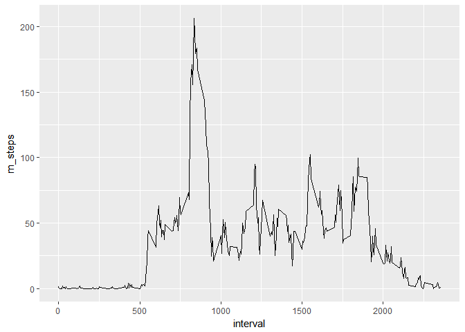
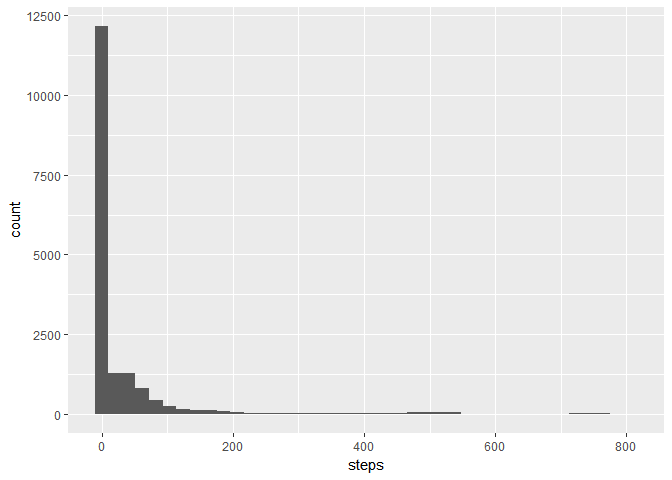
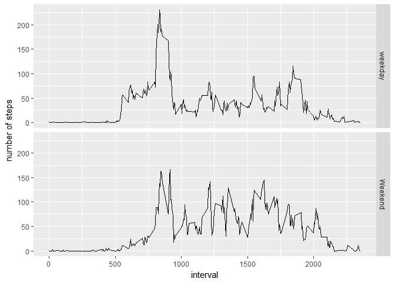

Load library


```r
library(tidyverse)
library(recipes)
```

```
## Warning: package 'recipes' was built under R version 3.4.4
```

## Loading and preprocessing the data


```r
activity <- read_csv("activity.zip", col_types = cols(date = col_date(format = "%Y-%m-%d"), 
                                                      steps = col_integer()), na = "NA")
```


```r
activity
```

```
## # A tibble: 17,568 x 3
##    steps date       interval
##    <int> <date>        <int>
##  1    NA 2012-10-01        0
##  2    NA 2012-10-01        5
##  3    NA 2012-10-01       10
##  4    NA 2012-10-01       15
##  5    NA 2012-10-01       20
##  6    NA 2012-10-01       25
##  7    NA 2012-10-01       30
##  8    NA 2012-10-01       35
##  9    NA 2012-10-01       40
## 10    NA 2012-10-01       45
## # ... with 17,558 more rows
```

## What is mean total number of steps taken per day?

Here's the histgram

```r
activity %>% group_by(date) %>% 
    ggplot(aes(steps)) + geom_histogram(bins = 40)
```

```
## Warning: Removed 2304 rows containing non-finite values (stat_bin).
```

<!-- -->

For mean and median

```r
activity %>% group_by(date) %>% 
    summarise(mean = mean(steps, na.rm = T),
              median = median(steps, na.rm = T))
```

```
## # A tibble: 61 x 3
##    date          mean median
##    <date>       <dbl>  <dbl>
##  1 2012-10-01 NaN         NA
##  2 2012-10-02   0.438      0
##  3 2012-10-03  39.4        0
##  4 2012-10-04  42.1        0
##  5 2012-10-05  46.2        0
##  6 2012-10-06  53.5        0
##  7 2012-10-07  38.2        0
##  8 2012-10-08 NaN         NA
##  9 2012-10-09  44.5        0
## 10 2012-10-10  34.4        0
## # ... with 51 more rows
```


## What is the average daily activity pattern?


Here's the line plot

```r
activity %>% group_by(interval) %>% 
    summarise( m_steps = mean(steps, na.rm = T)) %>% 
    ggplot(aes(interval, m_steps)) + geom_line()
```

<!-- -->

The interval 835 has the maximum number of steps.

```r
activity %>% group_by(interval) %>% 
    summarise( m_steps = mean(steps, na.rm = T)) %>% 
    arrange(desc(m_steps)) %>% slice(1)
```

```
## # A tibble: 1 x 2
##   interval m_steps
##      <int>   <dbl>
## 1      835     206
```
## Imputing missing values

From below, here are 2304 row contain NA. 

```r
activity %>% filter(is.na(steps) | is.na(interval) | is.na(date)) %>% 
    summarise(n_NA = n())
```

```
## # A tibble: 1 x 1
##    n_NA
##   <int>
## 1  2304
```

impute steps with mean, use floor values to keep it as integer.

```r
imp_fun <- function(dat){
    dat %>% recipe(~steps + date, data = .) %>% 
                 step_meanimpute(steps) %>% prep(retain = T) %>% 
                 juice()
}
nes <- activity %>% group_by(interval) %>% 
    nest() %>% mutate(data = map(data, imp_fun))
                        
imputed_df <- nes %>% unnest() %>% mutate(steps = as.integer(steps)) %>% arrange(date)

imputed_df
```

```
## # A tibble: 17,568 x 3
##    interval steps date      
##       <int> <int> <date>    
##  1        0     1 2012-10-01
##  2        5     0 2012-10-01
##  3       10     0 2012-10-01
##  4       15     0 2012-10-01
##  5       20     0 2012-10-01
##  6       25     2 2012-10-01
##  7       30     0 2012-10-01
##  8       35     0 2012-10-01
##  9       40     0 2012-10-01
## 10       45     1 2012-10-01
## # ... with 17,558 more rows
```


```r
imputed_df %>% group_by(date) %>% 
    ggplot(aes(steps)) + geom_histogram(bins = 40)
```

<!-- -->

```r
imputed_df%>% group_by(date) %>% 
    summarise(mean = mean(steps, na.rm = T),
              median = median(steps, na.rm = T))
```

```
## # A tibble: 61 x 3
##    date         mean median
##    <date>      <dbl>  <dbl>
##  1 2012-10-01 36.9     33.5
##  2 2012-10-02  0.438    0  
##  3 2012-10-03 39.4      0  
##  4 2012-10-04 42.1      0  
##  5 2012-10-05 46.2      0  
##  6 2012-10-06 53.5      0  
##  7 2012-10-07 38.2      0  
##  8 2012-10-08 36.9     33.5
##  9 2012-10-09 44.5      0  
## 10 2012-10-10 34.4      0  
## # ... with 51 more rows
```
The result doesn't change much. Some days which are previous NA now have values.


## Are there differences in activity patterns between weekdays and weekends?


Here's the dataframe after adding the new factor variable.

```r
imp_fac <- imputed_df %>% mutate(wd = case_when(weekdays(date) %in% c("Saturday", "Sunday") ~ "Weekend",
                                     TRUE ~ "weekday")) %>% mutate(wd = factor(wd))
imp_fac
```

```
## # A tibble: 17,568 x 4
##    interval steps date       wd     
##       <int> <int> <date>     <fct>  
##  1        0     1 2012-10-01 weekday
##  2        5     0 2012-10-01 weekday
##  3       10     0 2012-10-01 weekday
##  4       15     0 2012-10-01 weekday
##  5       20     0 2012-10-01 weekday
##  6       25     2 2012-10-01 weekday
##  7       30     0 2012-10-01 weekday
##  8       35     0 2012-10-01 weekday
##  9       40     0 2012-10-01 weekday
## 10       45     1 2012-10-01 weekday
## # ... with 17,558 more rows
```
Here are the plots.

```r
imp_fac %>% group_by(wd,interval) %>% summarise(m_steps = mean(steps, na.rm = T)) %>% 
    ggplot(aes(x = interval, y =m_steps)) + geom_line() + facet_grid(wd~.) + ylab("number of steps")
```

<!-- -->


